# LLM System Patterns

<p align="center">
  
  
  
  
  
</p>

<p align="center"><br/></p>

<p align="center">
  
</p>

> Practical patterns for building reliable LLM systems with retrieval, ranking, scoring, guardrails, and production-minded engineering tradeoffs.

<p align="center">
  
</p>

## What You'll Learn Fast

- When keyword search beats embeddings
- When embeddings help and where they fail
- Why hybrid retrieval is often the safer default
- When reranking is worth the extra stage
- Why LLM judgment belongs late, not first
- How to block obvious prompt attacks before they reach the main model
- How to turn model output into typed application data safely
- How cost, latency, and evaluation shape the architecture itself

## System Map


Most LLM projects start with "send everything to the model." This repo is the opposite instinct: narrow first, reason last, and keep each stage honest about what it is good at.

## Start Here

1. [Pattern 01](patterns/01-pre-filter-embed-llm-judge.md) for the flagship layered pipeline.
2. [Embedding vs Keyword vs Hybrid](decision-guides/embedding-vs-keyword-vs-hybrid.md) for the retrieval decision.
3. [Pattern 04](patterns/04-reranker-when-and-why.md) for precision tradeoffs.
4. [Proposal to Brief Matching](examples/proposal-to-brief-matching-basic/README.md) for the first end-to-end build path.

For orchestration-heavy agent workflows, see [langgraph-design-patterns](https://github.com/SaqlainXoas/langgraph-design-patterns).

## Read By Job

| If you need | Start here | Then follow with |
|---|---|---|
| A full layered mental model | [Pattern 01](patterns/01-pre-filter-embed-llm-judge.md) | [Pattern 04](patterns/04-reranker-when-and-why.md) |
| Retrieval choice help | [Embedding vs Keyword vs Hybrid](decision-guides/embedding-vs-keyword-vs-hybrid.md) | [Pattern 02](patterns/02-hybrid-search-keyword-semantic.md) |
| Production vector retrieval with filters | [Pattern 13](patterns/13-metadata-filters-before-vector-search.md) | [Metadata-Filtered Vector Search](examples/metadata-filtered-vector-search/README.md) |
| Better top-k quality | [When to Use a Reranker](decision-guides/when-to-use-reranker.md) | [Pattern 04](patterns/04-reranker-when-and-why.md) |
| Final LLM scoring guidance | [When to Use LLM-as-Judge](decision-guides/when-to-use-llm-as-judge.md) | [Pattern 01](patterns/01-pre-filter-embed-llm-judge.md) |
| A simple prompt injection defense | [Pattern 15](patterns/15-prompt-injection-fast-filter-blind-judge.md) | [Pattern 06](patterns/06-prompt-injection-defense.md) |
| Safe structured model output | [Pattern 14](patterns/14-structured-output-contracts.md) | [Structured Output Contracts](examples/structured-output-contracts/README.md) |
| A practical build path | [Proposal to Brief Matching](examples/proposal-to-brief-matching-basic/README.md) | [Bulk Proposal Scoring](examples/bulk-proposal-scoring/README.md) |

## Pattern Map

### Core Patterns
- [01. Pre-filter -> Embed -> Rerank -> LLM Judge](patterns/01-pre-filter-embed-llm-judge.md)
- [02. Hybrid Search: Keyword + Semantic](patterns/02-hybrid-search-keyword-semantic.md)
- [03. The Abbreviation and Short-Token Problem](patterns/03-abbreviation-short-token-problem.md)
- [04. Reranker: When and Why](patterns/04-reranker-when-and-why.md)
- [05. Chunking Strategies](patterns/05-chunking-strategies.md)
- [06. Prompt Injection Defense](patterns/06-prompt-injection-defense.md)
- [07. Cost and Latency Budgeting](patterns/07-cost-latency-budgeting.md)
- [08. LLM-as-Judge Reliability](patterns/08-llm-as-judge-reliability.md)
- [09. Embedding Model Selection](patterns/09-embedding-model-selection.md)
- [10. Batch Calls and Throughput](patterns/10-batch-calls-and-throughput.md)
- [11. In-Memory Batch Scoring vs Vector DB](patterns/11-in-memory-batch-scoring-vs-vector-db.md)
- [12. Cache, Cleanup, and Memory Control](patterns/12-cache-cleanup-and-memory-control.md)
- [13. Metadata Filters Before Vector Search](patterns/13-metadata-filters-before-vector-search.md)
- [14. Structured Output Contracts](patterns/14-structured-output-contracts.md)
- [15. Prompt Injection Fast Filter + Blind Judge](patterns/15-prompt-injection-fast-filter-blind-judge.md)

### Decision Guides
- [Embedding vs Keyword vs Hybrid](decision-guides/embedding-vs-keyword-vs-hybrid.md)
- [When to Use a Reranker](decision-guides/when-to-use-reranker.md)
- [When to Use LLM-as-Judge](decision-guides/when-to-use-llm-as-judge.md)
- [RAG vs Fine-Tuning](decision-guides/rag-vs-fine-tuning.md)

### Example Tracks
- [Cookbook](examples/README.md)
- [Proposal to Brief Matching](examples/proposal-to-brief-matching-basic/README.md)
- [Bulk Proposal Scoring](examples/bulk-proposal-scoring/README.md)
- [Proposal to Brief with Vector Store](examples/proposal-to-brief-with-vector-store/README.md)
- [Metadata-Filtered Vector Search](examples/metadata-filtered-vector-search/README.md)
- [Hybrid Search Pipeline](examples/hybrid-search-pipeline/README.md)
- [RAG Without Frameworks](examples/rag-without-frameworks/README.md)
- [Structured Output Contracts](examples/structured-output-contracts/README.md)

## Repo Family

- `langgraph-design-patterns`: orchestration, routing, memory, workflow control, human review loops
- `ai-research-notes`: papers, ideas, experiments, and concept-first research summaries
- `llm-system-patterns`: retrieval, ranking, scoring, reliability, and production-minded system tradeoffs

Together they form a cleaner path from concept to system shape to orchestration.

## Current Status

The repo now has:

- a stable identity and visual system
- the flagship retrieval and ranking docs in place
- decision guides that point readers to the right pattern faster
- example tracks shaped around real implementation paths
- proposal-safe public framing for the flagship scoring examples

```text
llm-system-patterns/
├── README.md
├── patterns/
├── decision-guides/
├── examples/
│   ├── proposal-to-brief-matching-basic/
│   ├── bulk-proposal-scoring/
│   ├── proposal-to-brief-with-vector-store/
│   ├── metadata-filtered-vector-search/
│   ├── hybrid-search-pipeline/
│   ├── rag-without-frameworks/
│   └── structured-output-contracts/
└── assets/
    ├── diagrams/
    └── svg/
```

The core roadmap is now in place. What remains is optional polish, expansion, or future example depth.

## Contributing
- See [CONTRIBUTING.md](CONTRIBUTING.md).

## License
MIT (see [LICENSE](LICENSE)).
