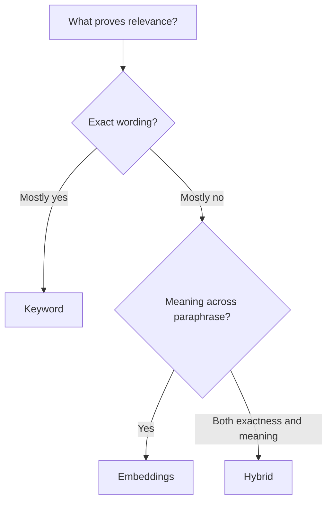

# Decision Guide: Embedding vs Keyword vs Hybrid

 

## Quick take
Use `keyword` when exact terms are the main truth signal, `embeddings` when meaning matters more than phrasing, and `hybrid` when the task needs both exactness and semantic flexibility.



| Situation | Best starting point | Why |
|---|---|---|
| Exact terms are mandatory | `Keyword` | Hard lexical evidence matters more than paraphrase |
| Meaning matters more than wording | `Embeddings` | Semantic similarity covers language variation |
| Both exact terms and related meaning matter | `Hybrid` | You need both lexical and semantic signals |
| Short tokens, acronyms, IDs, and required skills matter | `Keyword` or `Hybrid` | These often need exact support |
| Top-k quality matters before an LLM step | `Hybrid` plus rerank | Better recall and cleaner final ordering |

## How to choose quickly
Do not ask which method is more advanced. Ask what kind of evidence proves relevance in this problem.

Choose `keyword` first when exact phrase presence, abbreviations, IDs, certifications, or legal wording matter. Choose `embeddings` first when the same idea appears in many phrasings and intent similarity matters more than exact wording, such as similar-document matching or resume-to-JD skill matching based on semantic overlap. Choose `hybrid` when both conditions are true at the same time, which is why so many serious retrieval systems eventually move there.

Two quick tests help: if missing a short acronym, document abbreviation, or skill code makes the result unacceptable, do not rely on embeddings alone. That is one of the clearest semantic bottlenecks, and it usually means you need keyword support or a hybrid setup. If changing the exact wording should still preserve the match, do not rely on keyword search alone.

## Practical default
If you are unsure, start here:

```text
hard filters
-> keyword and embedding retrieval together
-> merge candidate sets
-> rerank only if top-k quality is still weak
```

That path is usually easier to improve than an embedding-only design that never respected exactness.

---
[](../README.md)
[](../patterns/02-hybrid-search-keyword-semantic.md)
[](when-to-use-reranker.md)
