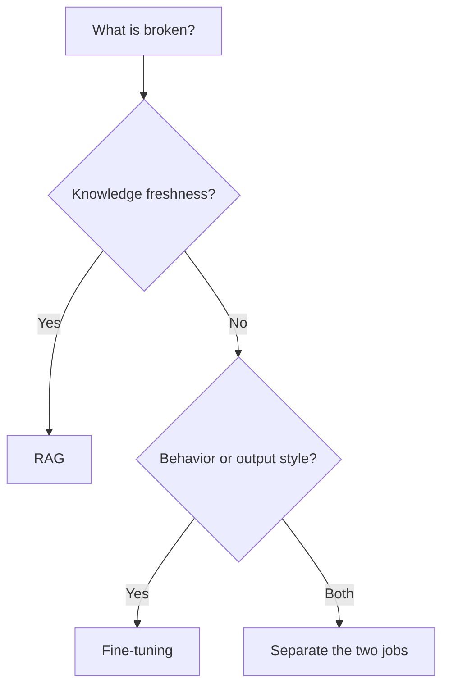

# Decision Guide: RAG vs Fine-Tuning

## Quick take
Prefer retrieval when the challenge is fresh or changing knowledge. Consider fine-tuning when the challenge is behavior, structure, or repeated task style rather than missing information.

## Why this matters
RAG solves the knowledge access problem. Fine-tuning solves the model behavior problem. Confusing the two usually leads to expensive systems that still do not address the real failure mode.

This guide will expand into clearer case splits, but the high-level rule is simple: do not fine-tune to memorize changing facts, and do not add retrieval when the real problem is stable task behavior or output format.

---

