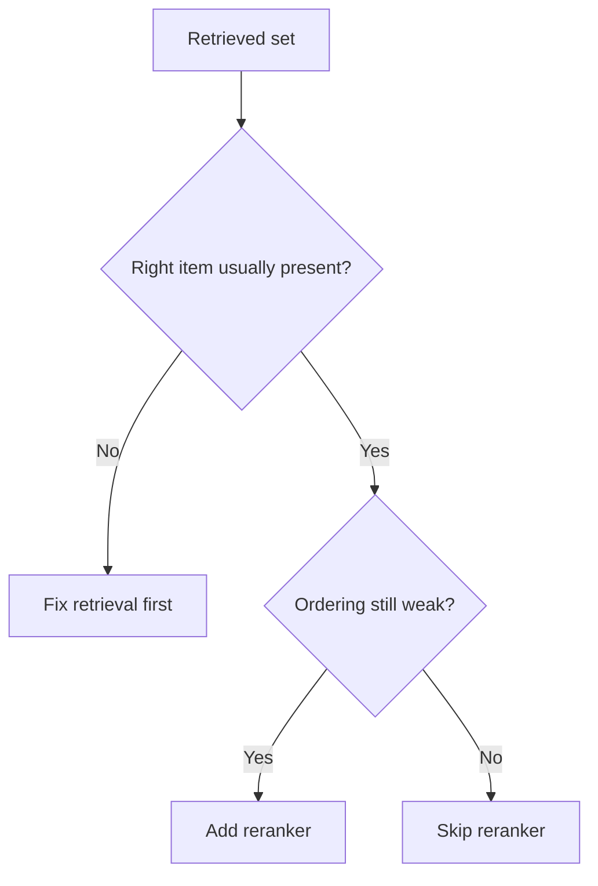

# Decision Guide: When to Use a Reranker

 

## Quick take
Add a reranker when recall is decent but ordering is weak. Skip it when the candidate set is already small and clean, and do not use reranking to hide a broken retrieval stage.



| Situation | Recommendation | Why |
|---|---|---|
| Right answer is usually retrieved but buried | `Use a reranker` | Classic reranker case |
| Results are already well ordered | `Skip it` | Extra cost with little gain |
| Candidate set is tiny | `Usually skip it` | Not much to improve |
| Downstream LLM is too expensive on noisy top-k | `Use a reranker` | Cleaner shortlist reduces final-stage cost |
| Retrieval often misses the right item entirely | `Fix retrieval first` | Reranking cannot recover missing candidates |

## How to think about it
The real question is not whether rerankers are more accurate. They often are. The real question is whether the precision gain is worth the extra stage in this pipeline.

Rerankers shine when the top few results matter a lot, when hybrid retrieval is broad but promising, or when only a few chunks should survive into RAG or an LLM judge. They are a poor fit when the retrieval stage is already clean or when recall itself is still broken.

## Practical default
If you suspect you need one, try:

```text
retrieve top 30-50
-> rerank
-> keep top 5-10
```

That is often enough to improve quality without making the system feel heavy.

---
[](../README.md)
[](../patterns/04-reranker-when-and-why.md)
[](when-to-use-llm-as-judge.md)
