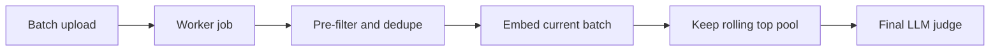

# Bulk Proposal Scoring

   

## Goal
Learn the scaled scoring shape:
1. batch the incoming proposals
2. keep only the best rolling pool
3. send the final shortlist to the LLM

## Flow


## What this example is
- A public-safe version of the bulk engineering pattern.
- A cleaner place to teach batching, cache boundaries, and memory cleanup.
- A service-file example instead of a full app shell.

## File walkthrough order
1. `filters.py`
2. `batching.py`
3. `matching.py`
4. `llm.py`
5. `sample_data/brief.json`
6. `sample_data/proposals.json`

## Why this example matters
This is the "do the real batch work first" version of the repo. It shows how to keep the architecture lighter when:
- the brief changes per run
- the proposal batch is temporary
- the shortlist is what really matters

That is why this example stays in-memory and focuses on engineering rhythm instead of introducing a vector DB too early.

## End-to-end worker shape
The code path to follow is:

```text
load proposals
-> drop duplicates
-> split into batches
-> cache the brief embedding once
-> score one batch at a time
-> keep only the rolling top pool
-> clean up finished batch rows
-> judge the final shortlist
```

This is where the internal engineering lesson shows up most clearly: cache only what repeats, trim early, and release finished batch state as you move forward.

---
[](../../README.md)
[](../README.md)
[](../proposal-to-brief-matching-basic/README.md)
[](../../patterns/10-batch-calls-and-throughput.md)
[](../proposal-to-brief-with-vector-store/README.md)
