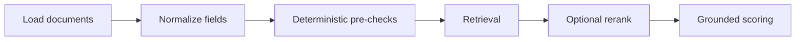

# Document Scoring Pipeline

  

## Quick take
This is the first end-to-end build path for the repo. It shows how to score documents with a layered system instead of an LLM-first shortcut.



## Why this example comes first
Document scoring naturally contains exact constraints, semantic similarity, ordering problems, cost tradeoffs, and grounded evaluation needs. That makes it the cleanest place to turn the repo's core philosophy into code.

The point is not to showcase a framework. The point is to show system shape and engineering judgment in a form that readers can follow stage by stage.

## What this build will teach
The implementation path is intentionally simple: load and normalize documents, remove obvious hard mismatches, retrieve the most relevant candidates, optionally rerank if the ordering is still soft, and ask the model to score only the final shortlist against explicit criteria.

When the code lands, readers should be able to inspect what got filtered out, what got retrieved, whether reranking helped, what evidence the final score used, and where cost or latency concentrate.

For a resume-scoring version of this example, the same pattern becomes:

```text
parse resume text
-> hard-skill or regex pre-check
-> embedding similarity against the JD
-> shortlist the strongest profiles
-> final LLM validation with criteria and evidence
```

That gives the user both the design concept and the practical scoring path.

## Repo shape

```text
examples/document-scoring-pipeline/
├── README.md
├── app.py
├── scorer.py
├── retrieval.py
├── filters.py
├── prompts.py
└── sample_data/
```

## Files

| File | What it does |
|---|---|
| `app.py` | runs the full example end to end |
| `filters.py` | loads data and applies hard pre-checks |
| `retrieval.py` | handles local semantic scoring, hybrid retrieval, and reranking |
| `scorer.py` | turns the shortlist into final scored results |
| `prompts.py` | shows what a grounded final LLM validation prompt can look like |
| `sample_data/` | small local job and resume files for a reproducible run |

## Run it

```bash
python3 examples/document-scoring-pipeline/app.py
```

The example uses only the Python standard library. The local embedding model is a tiny teaching stand-in so the pipeline stays runnable without API keys.

---
[](../../README.md)
[](../../patterns/01-pre-filter-embed-llm-judge.md)
[](../scaled-document-scoring/README.md)
