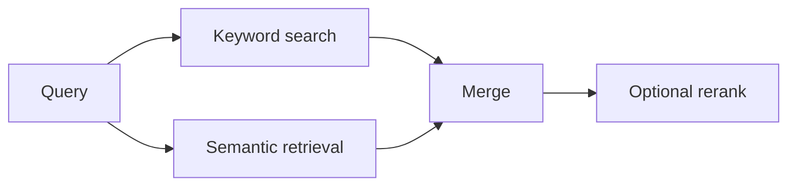

# Hybrid Search Pipeline

  

## Quick take
This example combines exact matching and semantic retrieval in a clean implementation without hiding the retrieval logic inside heavy abstractions.

## What this example is for
The focus here is keyword signals, semantic retrieval, score merging, and failure-case analysis. It will be the concrete companion to the hybrid retrieval docs so readers can see how lexical and semantic signals cooperate in code.

---

