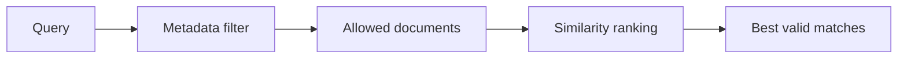

# Metadata-Filtered Vector Search

   

## Goal
Learn the clean filter-first retrieval shape used in persistent vector systems:
1. narrow the allowed document set with metadata
2. rank only that allowed set by similarity
3. avoid trusting top-k from the full index

The main idea is simple: do not run broad semantic search across your whole knowledge base or vector database if the answer must already come from a smaller allowed subset.

## Flow


## What this example shows
- a real vector retrieval flow
- one query across all documents
- the same query with a metadata filter
- why semantically similar but invalid documents can pollute top-k
- what to do when the filter returns zero documents

## Real retrieval flow
This is the production-shaped lesson behind the example:

```text
ingest documents
-> store each document with metadata
-> run a query across the collection
-> run the same query again with hard metadata filters
-> compare the returned top-k
-> handle the zero-match case safely
```

The important design rule is:
- metadata filters decide the allowed slice
- vector similarity ranks inside that slice

That is true no matter which vector database you use.

In other words:
- do not search the whole knowledge base first
- narrow the pool with metadata
- then let semantic search rank only inside that narrowed pool

## Generic query shape
Most vector stores end up looking roughly like this:

```python
vector_store.add(
    ids=[...],
    documents=[...],
    metadatas=[...],
)

naive_results = vector_store.query(
    query_text="What is the refund policy for delayed delivery?",
    top_k=3,
)

filtered_results = vector_store.query(
    query_text="What is the refund policy for delayed delivery?",
    top_k=3,
    filter={
        "region": "US",
        "document_type": "policy",
        "status": "published",
    },
)
```

The repo code uses a local store so the flow is runnable, but the retrieval pattern is meant to transfer to any vector DB with metadata filtering.

## Demo query and filters
Query:

```text
What is the refund policy for delayed delivery?
```

Metadata filter:

```python
{
    "region": "US",
    "document_type": "policy",
    "status": "published",
}
```

## How to run

```bash
pip install chromadb
python3 main.py
```

On first run, Chroma may download its default embedding model locally.

## What to look for in the output
- The naive query includes wrong-region, draft, or wrong-type documents because they use very similar language.
- The filtered query keeps only published US policy documents in the race.
- The zero-result example shows the safer fallback when no document matches the filter.

## File walkthrough order
1. `main.py`

---
[](../../README.md)
[](../README.md)
[](../proposal-to-brief-with-vector-store/README.md)
[](../../patterns/13-metadata-filters-before-vector-search.md)
[](../hybrid-search-pipeline/README.md)
