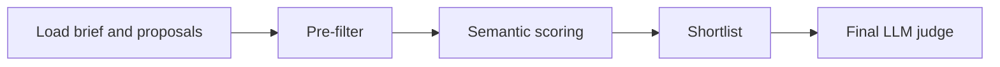

# Proposal to Brief Matching

  

## Goal
Learn the clean first-pass scoring flow used in this repo:
1. exact pre-filter first
2. semantic scoring second
3. final LLM validation last

## Flow

## What this example is
- A small public-safe version of the flagship scoring pipeline.
- Service-style files that are easy to copy into another project.
- A clean place to teach acronym handling such as `SOC 2`, `SSO`, and similar exact-term checks.

## What this example is not
- Not a full application shell.
- Not a framework demo.
- Not a vector-store example.

## File walkthrough order
1. `filters.py`
2. `matching.py`
3. `llm.py`
4. `sample_data/brief.json`
5. `sample_data/proposals.json`

## Why this shape comes first
This layout keeps the core lesson readable:
- use hard filters for required capabilities
- let embeddings recover meaning after that
- ask the LLM to compare only the best few proposals

The same idea also applies to skills filtering, acronym-heavy matching, and other exact-plus-semantic retrieval problems.

---

