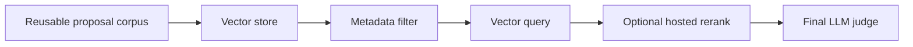

# Proposal to Brief with Vector Store

   

## Goal
Learn the persistent-store version of the same retrieval problem:
1. store reusable proposal vectors
2. query by brief
3. rerank and judge the returned set

## Flow

## What this example is
- A light scaffold for persistent retrieval.
- A place to compare Pinecone with a local Chroma setup.
- A companion to the in-memory batch example, not a replacement for it.

## File walkthrough order
1. `vector_store.py`
2. `matching.py`
3. `llm.py`
4. `sample_data/brief.json`
5. `sample_data/proposals.json`

## Why this example exists
This track answers a different question than bulk scoring:
- not "score this one batch now"
- but "store reusable proposal vectors and search them repeatedly"

That is the point where a persistent vector layer becomes worth discussing.

If you want the cleanest example of metadata filters narrowing the search space before similarity ranking, see [Metadata-Filtered Vector Search](../metadata-filtered-vector-search/README.md). That example stays local and focuses on the filter-first retrieval pattern itself.

---

