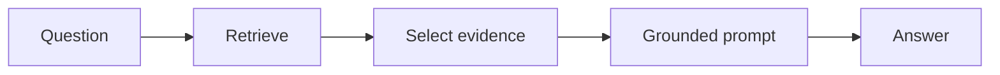

# RAG Without Frameworks

 

## Quick take
This example is a minimal retrieval pipeline built with plain Python and direct API usage rather than heavy orchestration tooling.

## What this example is for
The focus is lightweight setup, direct retrieval steps, grounded prompting, and evaluation basics. It is the repo's "show the moving parts clearly" track for readers who want the system without a framework layer.

---

