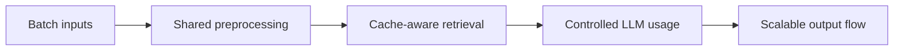

# Scaled Document Scoring

 

## Quick take
This example track shows how the same document-scoring pipeline changes once throughput, memory, and cost constraints become serious.

## What this example is for
The focus is batching, parallel-safe stages, cache lifecycle management, memory cleanup, and reducing unnecessary LLM calls. It is the scale-up companion to the first plain document-scoring build.

---

