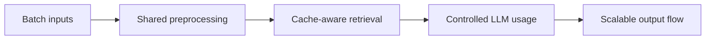

# Scaled Document Scoring

 

## Quick take
This example track shows how the same document-scoring pipeline changes once throughput, memory, and cost constraints become serious.



## What this example is for
The focus is batching, parallel-safe stages, cache lifecycle management, memory cleanup, and reducing unnecessary LLM calls. It is the scale-up companion to the first plain document-scoring build.

## Optimized batch shape
One strong scale-up shape is bulk resume or bulk document scoring without a vector DB:

```text
batch extract or parse
-> batch embeddings
-> score against the active query or JD
-> keep only the best few items
-> run final LLM validation on the shortlist
-> clean up RAM for the finished batch
```

This works especially well when the task is "score this batch now" instead of "build a permanent searchable knowledge base."

## Why this matters
People often reach for a vector DB by default, but it is not always the right first optimization. If the data is being processed in one run, a simpler approach can be:
- parse on demand
- embed on demand
- cache only what repeats inside the run
- score and rank immediately
- release memory after the batch finishes

That is a real system-design pattern, not just a coding shortcut. It keeps the architecture lighter while still using batching, caching, and shortlist-based LLM validation.

---
[](../../README.md)
[](../document-scoring-pipeline/README.md)
