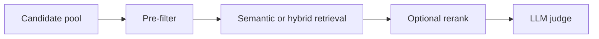

# Pattern 01: Pre-filter -> Embed -> Rerank -> LLM Judge

  

## Quick take
Do the cheap, reliable narrowing first. Ask the LLM to reason only after the candidate set is already small.



## Why this pattern exists
Many systems start by asking one big model to search, compare, rank, and explain everything at once. That can work for a small demo, but it starts failing when the pool is large, some constraints are non-negotiable, abbreviations matter, or cost and latency finally become visible.

This pattern splits the work by job instead of by hype. Deterministic logic handles hard rules. Retrieval handles recall. Reranking handles precision. The LLM handles the final reasoning over a small, grounded shortlist.

| Stage | Job | Why it belongs there |
|---|---|---|
| `Pre-filter` | Remove clearly invalid candidates | Cheapest place to enforce hard constraints |
| `Semantic retrieval` | Recover meaning across different wording | Best stage for recall, not final judgment |
| `Rerank` | Clean up ordering inside the shortlist | Useful when retrieval is close but noisy |
| `LLM judge` | Compare the narrowed set and explain | Strongest when the context is bounded |

## How the flow works
Use `pre-filter` first for things that should never be fuzzy: required language, mandatory certifications, exact region, compliance tags, product family, or safe numeric thresholds. This stage is cheap, fast, and explainable, so it should absorb as much hard logic as possible.

Use `semantic retrieval` or `hybrid retrieval` after that to recover meaning across phrasing differences such as `software engineer` versus `backend developer` or `fraud prevention` versus `risk controls`. Retrieval is there to produce a good pool, not the final answer.

Add `rerank` only when the right answer is already in the retrieved set but the ordering is still weak. Then let the `LLM judge` compare only the narrowed shortlist against explicit criteria. At that point the model is no longer searching the universe; it is reading a well-shaped problem.

## Before embedding
This repo keeps repeating one important design rule: do not jump into embeddings before you have used the cheap signals you already trust.

For bulk resume scoring, `before embedding` usually means:
- regex or keyword checks for hard skills
- ID or document-type checks
- country, region, or language filters
- exact abbreviation checks like `RN`, `CPA`, `SOC 2`, or `C++`

This first pass is where a lot of bulk noise gets removed. That makes the semantic layer cheaper and more accurate because it no longer has to compare obviously invalid items.

## Practical example
Document scoring is a clean fit for this pattern. Imagine scoring proposals against a requirements sheet, profiles against a role definition, or policy documents against a compliance checklist.

The weak version is: give everything to the LLM and ask it to choose. The stronger version is: filter hard mismatches, retrieve by meaning, rerank if top-k quality still feels soft, and ask the model to score only the final few candidates using evidence from the provided text.

That structure lowers cost, lowers latency, enforces hard rules deterministically, and makes debugging easier because you can inspect which stage failed.

For bulk resume processing, the same shape works well:

```text
extract and parse resume
-> regex or hard-skill pre-check
-> embedding similarity against JD
-> optional rerank or score normalization
-> final LLM validation on the best few resumes
```

That is very different from a naive LLM-first design, and it is also different from "store everything in a vector DB first and figure it out later." If the resumes are being scored in one pipeline run, you can often parse, embed, score, and clean up in-memory without a vector DB at all.

## Implementation blueprint
For a resume-to-JD matcher or document scorer, a beginner-friendly first version is easier to understand when it runs top to bottom:

```python
# Step 1: keep only items that pass hard rules.
filtered_items = []
for item in items:
    same_country = item["country"] == query["country"]
    has_required_skill = query["must_have_skill"].lower() in item["text"].lower()

    if same_country and has_required_skill:
        filtered_items.append(item)

# Step 2: score the remaining items with embeddings.
query_vector = embed(query["text"])
semantic_scores = []

for item in filtered_items:
    item_vector = embed(item["text"])
    score = cosine_similarity(query_vector, item_vector)
    semantic_scores.append({"item": item, "score": score})

semantic_scores.sort(key=lambda row: row["score"], reverse=True)
top_50 = [row["item"] for row in semantic_scores[:50]]

# Step 3: rerank only the shortlist, not the full dataset.
rerank_scores = call_reranker(query["text"], [item["text"] for item in top_50])
reranked_rows = list(zip(top_50, rerank_scores))
reranked_rows.sort(key=lambda row: row[1], reverse=True)
top_10 = [item for item, _ in reranked_rows[:10]]

# Step 4: ask the LLM to judge only the final shortlist.
final_result = call_llm_judge(
    shortlist=top_10,
    criteria=query["criteria"],
)
```

Functions such as `embed`, `call_reranker`, and `call_llm_judge` are placeholders. The important part is the shape: hard checks first, semantic narrowing second, precision cleanup third, expensive reasoning last.

## What the stages usually look like
`metadata / regex filters` usually means country checks, exact skill names, explicit compliance tags, document type checks, or numeric thresholds that should not be left to the LLM.

`hybrid retrieval` usually means keyword top-k plus embedding top-k merged into one candidate set. This is especially useful when the system must respect abbreviations like `RN`, `SOC 2`, or `C++` but still recover paraphrases and related meaning.

`top-k narrowing` means setting a hard cap before the next expensive stage. For example, retrieve top 50, rerank top 20, then let the LLM judge only top 5. Those numbers are not magic. They are there to keep cost and noise bounded.

`LLM judge` usually means final validation against the user problem, not broad retrieval. The LLM should receive the narrowed candidates plus the scoring context, criteria, and supporting evidence. It should not be doing the bulk search job that earlier stages already solved more cheaply.

## Practical default
If you want a healthy default shape, start here:

```text
metadata / regex filters
-> hybrid retrieval
-> top-k narrowing
-> rerank top 20
-> LLM judge top 5
```

This is not universal, but it reflects the right instinct: deterministic first, semantic second, expensive reasoning last.

---
[](../README.md)
[](../decision-guides/embedding-vs-keyword-vs-hybrid.md)
[](../examples/document-scoring-pipeline/README.md)
[](02-hybrid-search-keyword-semantic.md)
