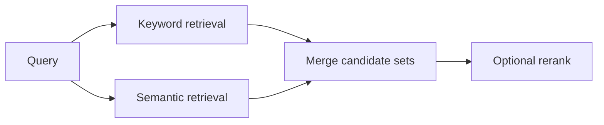

# Pattern 02: Hybrid Search, Keyword Plus Semantic

  

## Quick take
Hybrid retrieval exists because the two simple extremes both fail: keyword-only misses meaning, and embedding-only misses exactness.



## Why hybrid matters
Keyword search is still the best signal when exact product names, abbreviations, IDs, codes, version strings, regulated terms, or strict jurisdiction wording matter. It answers the question: did the text say the important thing?

Semantic retrieval is better when language varies. It helps match documents with similar content even when the wording changes, and it helps match proposal capabilities against a project brief when the phrases are close in meaning but not literally the same. It recovers `customer churn` versus `retention risk`, `vendor onboarding` versus `supplier activation`, or other paraphrases that lexical search can miss. It answers the question: did the text mean the important thing?

Real systems often need both answers at the same time.

| Problem shape | Best starting point | Why |
|---|---|---|
| Exact terminology is the truth signal | `Keyword` | Strong on hard lexical evidence |
| Meaning matters more than phrasing | `Embeddings` | Better on paraphrase and concept overlap |
| Exactness and semantic variation both matter | `Hybrid` | Most reliable default for real retrieval |

## When embeddings actually help
Embeddings help most when:
- two proposals describe the same capability in different language
- two documents are semantically similar even if the headings differ
- the project brief uses one phrase and the proposal uses another related phrase
- you need concept overlap, not literal word overlap

This is why embeddings are useful for proposal-to-brief scoring, similar-document lookup, and semantic retrieval over messy natural language.

## What hybrid actually looks like
There is no single hybrid architecture. The simplest useful shape is often `hard filters -> keyword top-k -> embedding top-k -> merge`. That works well when you want recall from both worlds without pretending one signal should dominate every case.

Another healthy shape is `keyword pre-filter -> embedding retrieval`, especially when mandatory terms must be enforced before any fuzzy reasoning. If the merged set is still noisy, add `rerank` after retrieval rather than making the retrieval stage itself overly clever.

The main caution is not to blend scores blindly. BM25 and cosine similarity are different signals, so the early goal is usually candidate generation first, score perfection later.

## Where systems usually go wrong
Embedding-only pipelines often look impressive in demos and then fail on short tokens like `SOC 2`, `GDPR`, `C++`, `S3`, `RN`, or domain acronyms. This is one of the main semantic bottlenecks: embeddings can understand broader meaning, but they often do not treat short abbreviations or document-specific acronyms as strong enough truth signals. That is exactly where keyword support or a hybrid design should step in.

Keyword-only pipelines fail in the other direction when users change phrasing and the system becomes brittle.

Hybrid starts becoming the right default when exact requirements exist alongside natural-language variation, false positives from semantic-only retrieval are costly, and false negatives from keyword-only retrieval are also costly. That is why enterprise search, document matching, support knowledge retrieval, and policy search often end up here.

General rule: the smaller the token, code, or abbreviation, the less safe it is to trust semantic matching alone. The exact behavior depends on the embedding model, but as a system rule you should assume short abbreviations need keyword or hybrid support.

## Implementation blueprint
A rough hybrid retrieval flow is easier to learn when it is written as one simple pipeline:

```python
# Step 1: keyword search for exact terms, abbreviations, and hard matches.
keyword_hits = keyword_search(query["text"], docs, top_k=20)

# Step 2: semantic search for similar meaning.
query_vector = embed(query["text"])
semantic_rows = []

for doc in docs:
    doc_vector = embed(doc["text"])
    score = cosine_similarity(query_vector, doc_vector)
    semantic_rows.append({"doc": doc, "score": score})

semantic_rows.sort(key=lambda row: row["score"], reverse=True)
semantic_hits = [row["doc"] for row in semantic_rows[:20]]

# Step 3: merge both candidate sets and remove duplicates.
merged_hits = dedupe_by_id(keyword_hits + semantic_hits)
```

That is intentionally simple. The first useful version is often just `keyword hits + semantic hits + merge`, not a complicated score-fusion system.

## Practical options
`keyword pre-filter -> semantic retrieval` is a strong fit when abbreviations, required skills, or exact document tags must be preserved before semantic recall expands the pool.

`keyword top-k + embedding top-k -> merge` is a strong fit when you want both exact lexical support and broader paraphrase recovery.

`hybrid -> rerank` is a strong fit when you already have good recall but the final ordering still feels noisy.

`bulk proposal scoring without vector DB` is a strong fit when you are processing one batch of proposals against one active brief or one requirements sheet. In that shape, you can parse the batch, compute embeddings in memory, score, keep the top few, and clean up memory after the run instead of building a permanent retrieval store.

## Practical default
For many production-minded systems, start here:

```text
hard filters
-> keyword top-k
-> embedding top-k
-> merge
-> rerank
-> final downstream task
```

If that feels too heavy, simplify to `hard filters -> embedding retrieval` with exact-term boosting or a keyword fallback.

---
[](../README.md)
[](01-pre-filter-embed-llm-judge.md)
[](../decision-guides/embedding-vs-keyword-vs-hybrid.md)
[](03-abbreviation-short-token-problem.md)
