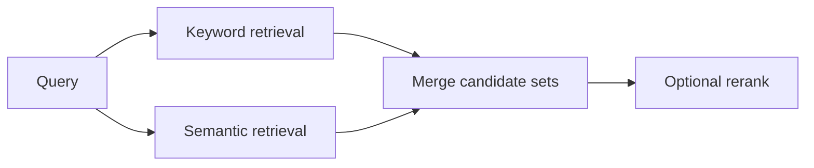

# Pattern 02: Hybrid Search, Keyword Plus Semantic

  

## Quick take
Hybrid retrieval exists because the two simple extremes both fail: keyword-only misses meaning, and embedding-only misses exactness.



## Why hybrid matters
Keyword search is still the best signal when exact product names, abbreviations, IDs, codes, version strings, regulated terms, or strict jurisdiction wording matter. It answers the question: did the text say the important thing?

Semantic retrieval is better when language varies. It helps match similar meaning, context, and intent even when the words are not exact. It answers the question: did the text mean the important thing?

| Semantic match examples | Why embeddings help |
|---|---|
| `customer churn` vs `retention risk` | same business idea, different wording |
| `JavaScript` vs `JS` | close skill meaning, sometimes weak lexical overlap |
| candidate profile vs job description | skillset and responsibilities can align without exact phrases |
| similar policy or proposal documents | headings differ, core meaning stays close |

Real systems often need both answers at the same time.

| Problem shape | Best starting point | Why |
|---|---|---|
| Exact terminology is the truth signal | `Keyword` | Strong on hard lexical evidence |
| Meaning matters more than phrasing | `Embeddings` | Better on paraphrase and concept overlap |
| Exactness and semantic variation both matter | `Hybrid` | Most reliable default for real retrieval |

## When embeddings actually help
Embeddings help most when:
- two documents describe the same capability in different language
- two documents are semantically similar even if the headings differ
- a job description uses one phrase and a candidate profile uses another related phrase
- a project brief uses one phrase and a proposal uses another related phrase
- you need concept overlap, not literal word overlap

That is why embeddings are useful for similar-document lookup, candidate or skill matching, proposal scoring, and messy natural-language retrieval in general.

## What hybrid actually looks like
There is no single hybrid architecture. The simplest useful shape is often `hard filters -> keyword top-k -> embedding top-k -> merge`. That works well when you want recall from both worlds without pretending one signal should dominate every case.

Another healthy shape is `keyword pre-filter -> embedding retrieval`, especially when mandatory terms must be enforced before any fuzzy reasoning. If the merged set is still noisy, add `rerank` after retrieval rather than making the retrieval stage itself overly clever.

The main caution is not to blend scores blindly. BM25 and cosine similarity are different signals, so the early goal is usually candidate generation first, score perfection later.

## Where systems usually go wrong
| System shape | What goes wrong |
|---|---|
| `Embedding only` | misses short tokens like `SOC 2`, `GDPR`, `C++`, `S3`, `RN`, or domain acronyms |
| `Keyword only` | breaks when users change phrasing or use synonyms |
| `Hybrid` | stronger default when both exactness and meaning matter |

The main semantic bottleneck is short tokens. Embeddings understand broader meaning well, but they often do not treat tiny abbreviations or document-specific acronyms as strong enough truth signals.

The practical rule is simple:

```text
small code or acronym -> protect it with keyword or hybrid support
broader meaning or paraphrase -> let embeddings help
```

That is why enterprise search, skills matching, policy retrieval, and document scoring so often end up hybrid.

## Implementation blueprint
A rough hybrid retrieval flow is easier to learn when it is written as one simple pipeline:

```python
# Step 1: keyword search for exact terms, abbreviations, and hard matches.
keyword_hits = keyword_search(query["text"], docs, top_k=20)

# Step 2: semantic search for similar meaning.
query_vector = embed(query["text"])
semantic_rows = []

for doc in docs:
    doc_vector = embed(doc["text"])
    score = cosine_similarity(query_vector, doc_vector)
    semantic_rows.append({"doc": doc, "score": score})

semantic_rows.sort(key=lambda row: row["score"], reverse=True)
semantic_hits = [row["doc"] for row in semantic_rows[:20]]

# Step 3: merge both candidate sets and remove duplicates.
merged_hits = dedupe_by_id(keyword_hits + semantic_hits)
```

That is intentionally simple. The first useful version is often just `keyword hits + semantic hits + merge`, not a complicated score-fusion system.

## Practical options
| Pattern | Good fit |
|---|---|
| `keyword pre-filter -> semantic retrieval` | abbreviations, required skills, or exact tags must survive before fuzzy matching expands recall |
| `keyword top-k + embedding top-k -> merge` | you want exact lexical support plus paraphrase recovery |
| `hybrid -> rerank` | the answer is already in the pool, but the ordering still feels messy |
| `in-memory batch scoring` | one active brief or one scoring run, no need for permanent storage |

## Practical default
For many production-minded systems, start here:

```text
hard filters
-> keyword top-k
-> embedding top-k
-> merge
-> rerank
-> final downstream task
```

If that feels too heavy, simplify to `hard filters -> embedding retrieval` with exact-term boosting or a keyword fallback.

---
[](../README.md)
[](01-pre-filter-embed-llm-judge.md)
[](../decision-guides/embedding-vs-keyword-vs-hybrid.md)
[](03-abbreviation-short-token-problem.md)
