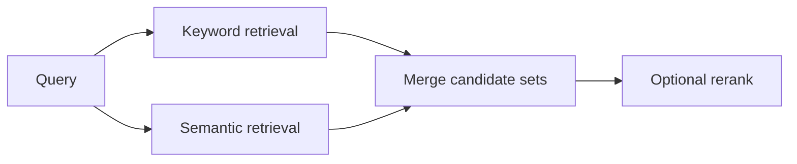

# Pattern 02: Hybrid Search, Keyword Plus Semantic

  

## Quick take
Hybrid retrieval exists because the two simple extremes both fail: keyword-only misses meaning, and embedding-only misses exactness.



## Why hybrid matters
Keyword search is still the best signal when exact product names, abbreviations, IDs, codes, version strings, regulated terms, or strict jurisdiction wording matter. It answers the question: did the text say the important thing?

Semantic retrieval is better when language varies. It recovers `customer churn` versus `retention risk`, `resume parser` versus `candidate profile extractor`, or other paraphrases that lexical search can miss. It answers the question: did the text mean the important thing?

Real systems often need both answers at the same time.

| Problem shape | Best starting point | Why |
|---|---|---|
| Exact terminology is the truth signal | `Keyword` | Strong on hard lexical evidence |
| Meaning matters more than phrasing | `Embeddings` | Better on paraphrase and concept overlap |
| Exactness and semantic variation both matter | `Hybrid` | Most reliable default for real retrieval |

## What hybrid actually looks like
There is no single hybrid architecture. The simplest useful shape is often `hard filters -> keyword top-k -> embedding top-k -> merge`. That works well when you want recall from both worlds without pretending one signal should dominate every case.

Another healthy shape is `keyword pre-filter -> embedding retrieval`, especially when mandatory terms must be enforced before any fuzzy reasoning. If the merged set is still noisy, add `rerank` after retrieval rather than making the retrieval stage itself overly clever.

The main caution is not to blend scores blindly. BM25 and cosine similarity are different signals, so the early goal is usually candidate generation first, score perfection later.

## Where systems usually go wrong
Embedding-only pipelines often look impressive in demos and then fail on short tokens like `SOC 2`, `GDPR`, `C++`, `S3`, `RN`, or domain acronyms. Keyword-only pipelines fail in the other direction when users change phrasing and the system becomes brittle.

Hybrid starts becoming the right default when exact requirements exist alongside natural-language variation, false positives from semantic-only retrieval are costly, and false negatives from keyword-only retrieval are also costly. That is why enterprise search, document matching, support knowledge retrieval, and policy search often end up here.

## Practical default
For many production-minded systems, start here:

```text
hard filters
-> keyword top-k
-> embedding top-k
-> merge
-> rerank
-> final downstream task
```

If that feels too heavy, simplify to `hard filters -> embedding retrieval` with exact-term boosting or a keyword fallback.

---
[](../README.md)
[](01-pre-filter-embed-llm-judge.md)
[](../decision-guides/embedding-vs-keyword-vs-hybrid.md)
[](03-abbreviation-short-token-problem.md)
