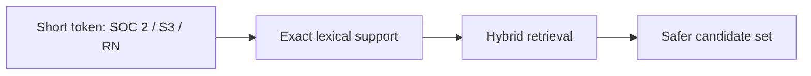

# Pattern 03: The Abbreviation and Short-Token Problem

 

## Quick take
Short tokens, acronyms, IDs, and domain abbreviations are common failure cases for semantic matching. If missing a tiny token makes the result unacceptable, embeddings alone are usually the wrong trust layer.



## Why this matters
Embedding systems are built to capture broader meaning, which is exactly why they can weaken or blur tiny but critical signals. A short acronym may carry all the business truth, but the vector signal may treat it as a faint hint instead of a hard requirement.

That is why dictionaries, exact matching, metadata checks, or keyword support still matter. Hybrid retrieval is often the repair layer because it keeps semantic flexibility without dropping the exact lexical anchor.

This shows up a lot in document retrieval and resume-to-JD matching. Semantic similarity may correctly understand that two documents are about related work, but it may still underweight a critical abbreviation, certification code, tool name, or short skill token that should have been treated as decisive.

## How to repair it
The usual repair pattern is simple:

```text
exact abbreviation check
-> keyword or metadata boost
-> semantic retrieval
-> merge candidate sets
```

That means if a skill code like `RN`, `C++`, `CPA`, or a compliance label like `SOC 2` is mandatory, you do not leave that truth entirely to embeddings.

```python
required_terms = query.get("required_terms", [])
doc_text = doc["text"].lower()

passed_all_terms = True
for term in required_terms:
    if term.lower() not in doc_text:
        passed_all_terms = False
        break
```

You can use `passed_all_terms` as a hard filter, a boosting signal, or a fallback path when semantic retrieval feels too loose.

## Where to use it
This pattern matters in compliance, skills matching, technical search, regulated domains, and any workflow where codes, versions, acronyms, document abbreviations, or required skill names must not be missed.

---
[](../README.md)
[](02-hybrid-search-keyword-semantic.md)
[](../decision-guides/embedding-vs-keyword-vs-hybrid.md)
[](04-reranker-when-and-why.md)
