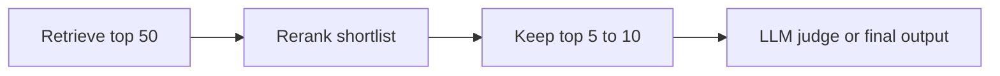

# Pattern 04: Reranker, When and Why

  

## Quick take
Rerankers are useful when the right candidates are already being retrieved, but the ordering is not strong enough.



## What a reranker is really fixing
Retrieval answers, "which items are probably relevant enough to consider?" Reranking answers, "among these candidates, which ones are most relevant in this exact query context?" That distinction matters because retrieval is usually the recall stage and reranking is usually the precision stage.

If the right answer is somewhere in the top 20 or top 50 but buried under near-matches, reranking can help a lot. That makes it especially useful before a user-facing ranking, before RAG context selection, or before an LLM judge that should only see the cleanest shortlist.

## When it earns its keep
Use a reranker when top-k quality matters more than broad recall, semantically similar candidates need finer separation, or the downstream LLM is doing too much sorting work on noisy results. Good examples include search systems where the first 3 items matter most, candidate shortlisting, document matching, and RAG systems with tight context budgets.

Skip it when the candidate set is already tiny, the retrieval ranking is already strong enough, or the latency budget is too tight to justify the extra stage. A reranker is not a repair tool for missing recall; if the right item never appears in the retrieved set, fix retrieval first.

## Practical default
The healthiest placement is usually:

```text
filter -> retrieve -> rerank -> final action
```

A good default shape is:

```text
retrieve top 30-50
-> rerank
-> keep top 5-10
```

That often improves quality while reducing how much noisy material reaches the final stage.

---
[](../README.md)
[](03-abbreviation-short-token-problem.md)
[](../decision-guides/when-to-use-reranker.md)
[](05-chunking-strategies.md)
