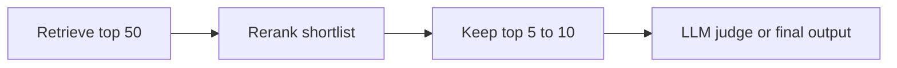

# Pattern 04: Reranker, When and Why

  

## Quick take
Rerankers are useful when the right candidates are already being retrieved, but the ordering is not strong enough.



## What a reranker is really fixing
Retrieval answers, "which items are probably relevant enough to consider?" Reranking answers, "among these candidates, which ones are most relevant in this exact query context?" That distinction matters because retrieval is usually the recall stage and reranking is usually the precision stage.

If the right answer is already somewhere in the top 20 or top 50 but buried under near-matches, this is where reranking does its best work. The answer is in the pool. The ordering is just not clean yet.

```text
retrieval found it
-> reranker sorts it better
-> final stage sees less noise
```

## When it earns its keep
| Use rerank when | Skip rerank when |
|---|---|
| top-k quality matters a lot | embedding ranking is already clean enough |
| retrieval returns many near-matches | the candidate set is already tiny |
| RAG context or final LLM stage is sensitive to noise | latency is too tight for another stage |
| the right answer is present but not sorted well | recall is broken and the answer is missing entirely |

A reranker is not a repair tool for missing recall. If the right answer never shows up in retrieval, fix retrieval first.

## How to use it
The reranker usually receives the raw query plus a shortlist of candidate texts. It outputs a better score for each query-document pair than broad retrieval gave you.

```python
# Step 1: prepare query-document pairs.
pairs = []
for candidate in candidates:
    pairs.append({
        "query": query_text,
        "text": candidate["text"],
    })

# Step 2: get reranker scores.
scores = call_reranker(pairs)

# Step 3: sort by reranker score and keep only the top few.
ranked_rows = list(zip(candidates, scores))
ranked_rows.sort(key=lambda row: row[1], reverse=True)
top_10 = [candidate for candidate, _ in ranked_rows[:10]]
```

In practice, `call_reranker` might call a hosted rerank API or a local cross-encoder model. The key architectural rule is the same either way: only rerank an already narrowed shortlist.

## Fast example
Imagine a chatbot RAG system retrieves 30 chunks. Ten are loosely related, five are strong, and two are exactly what the answer needs. Embeddings may put those exact two somewhere in the middle. Reranking is the stage that pushes the strongest chunks up before the final answer is generated.

That same pattern shows up in candidate shortlisting, proposal scoring, support search, and document matching.

## A healthy placement
Do not call the reranker over the full corpus. The healthier placement is:

```text
filter -> retrieve top 30-50 -> rerank -> keep top 5-10 -> final action
```

That final action might be showing results, selecting RAG chunks, or sending the cleanest candidates into an LLM judge.

## Tradeoff to remember
Reranking adds latency. For live chatbot RAG, that extra step can be noticeable. For background scoring, batch review, or offline ranking tasks, the tradeoff is usually easier to justify.

## Practical default
The healthiest placement is usually:

```text
filter -> retrieve -> rerank -> final action
```

A good default shape is:

```text
retrieve top 30-50
-> rerank
-> keep top 5-10
```

That often improves quality while reducing how much noisy material reaches the final stage.

---
[](../README.md)
[](03-abbreviation-short-token-problem.md)
[](../decision-guides/when-to-use-reranker.md)
[](05-chunking-strategies.md)
