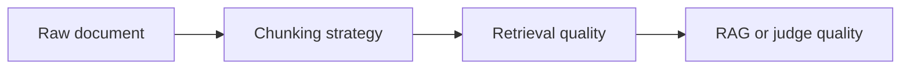

# Pattern 05: Chunking Strategies

 

## Quick take
Chunking is not just preprocessing. It changes recall, precision, context quality, cost, and what the downstream model is even able to judge correctly.

## Why this matters
Fixed-size chunks are easy, but they can split meaning at the wrong boundary. Structure-aware chunks are often better for long documents, policy sections, reports, or pages where headings and sections carry real signal. Overlap helps recall, but too much overlap increases noise, duplicate evidence, and cost.

The right chunking strategy depends on the job. Retrieval may benefit from smaller recall-friendly chunks, while final judgment often benefits from larger, more coherent evidence windows. That is why chunking should be treated as a system design choice, not just a loader setting.

## Where this goes next
This page will evolve into chunk size heuristics, overlap tradeoffs, and chunking patterns for retrieval versus final scoring.

---

