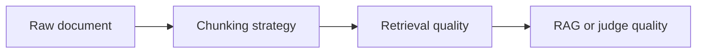

# Pattern 05: Chunking Strategies

 

## Quick take
Chunking is not just preprocessing. It changes recall, precision, context quality, cost, and what the downstream model is even able to judge correctly.



## Why this matters
Fixed-size chunks are easy, but they can split meaning at the wrong boundary. Structure-aware chunks are often better for long documents, policy sections, reports, or pages where headings and sections carry real signal. Overlap helps recall, but too much overlap increases noise, duplicate evidence, and cost.

The right chunking strategy depends on the job. Retrieval may benefit from smaller recall-friendly chunks, while final judgment often benefits from larger, more coherent evidence windows. That is why chunking should be treated as a system design choice, not just a loader setting.

## Common methods
`Fixed-size chunking` is the simplest method. Split every document into windows like 500 to 1000 characters with small overlap. This is a decent baseline when you just need something working fast.

`Structure-aware chunking` follows sections, headings, bullet groups, or paragraph blocks. This is usually better for reports, policies, and technical documents where the structure itself carries meaning.

`Two-pass chunking` is often strong in production: smaller chunks for retrieval, then stitch neighboring chunks together before final LLM judgment so the model sees a more coherent evidence window.

## Rough implementation ideas
If you are using a framework, a text splitter such as LangChain's recursive character splitter is a reasonable baseline. If you are not using a framework, the core logic is still simple:

```python
def chunk_text(text, chunk_size=800, overlap=120):
    chunks = []
    start = 0
    while start < len(text):
        end = start + chunk_size
        chunks.append(text[start:end])
        start = end - overlap
    return chunks
```

For structured documents, a better first version is often:

```python
def chunk_by_sections(section_blocks, max_chars=1200):
    chunks = []
    current = []
    current_len = 0
    for block in section_blocks:
        if current_len + len(block) > max_chars and current:
            chunks.append("\n".join(current))
            current = [block]
            current_len = len(block)
        else:
            current.append(block)
            current_len += len(block)
    if current:
        chunks.append("\n".join(current))
    return chunks
```

## Practical defaults
For retrieval, start with smaller chunks that preserve topical focus. For final judgment or citation, consider combining adjacent chunks so the model sees enough surrounding context to reason safely.

A practical first pass is:

```text
retrieve on chunks around 600-1000 chars
-> keep overlap modest
-> merge neighboring hits before final LLM use
```

That keeps retrieval sharp without starving the final stage of context.

---
[](../README.md)
[](04-reranker-when-and-why.md)
[](06-prompt-injection-defense.md)
