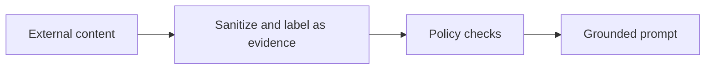

# Pattern 06: Prompt Injection Defense

 

## Quick take
Retrieved content is evidence, not authority. If external text can shape your downstream prompt, the pipeline needs explicit trust boundaries.

## Why this matters
Prompt injection problems usually grow when systems blur instruction text and evidence text together. A retrieved document can contain commands, roleplay attempts, or manipulative content that should never become part of the system instruction layer.

The fix is architectural before it is prompt-level: separate instructions from evidence, keep deterministic checks and policy filters ahead of the model, and require grounded outputs that operate only on the provided evidence.

## Where this goes next
This page will grow into trust-boundary patterns, evidence-only prompt design, and practical guardrails for retrieval-heavy systems.

---

