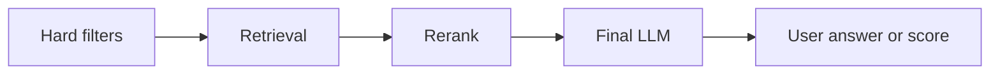

# Pattern 07: Cost and Latency Budgeting

  

## Quick take
Cost and latency are not cleanup topics. They are architecture topics, and the safest default is to push expensive work as late as possible.



## Why budgeting belongs at design time
A system can look correct in a notebook and still fail in practice because it makes too many model calls, sends too much text, processes oversized candidate pools, or repeats expensive work that should have been cached.

The fix is rarely just "use a cheaper model." The better fix is usually to stop unnecessary work from reaching the model at all. That is why narrowing, caching, and stage-level limits belong in the original design.

| Budget | What to watch |
|---|---|
| `Cost` | spend per request, batch, or day |
| `Latency` | p50 and p95 time per request |
| `Context` | how much text each model call sees |
| `Error` | how much quality drift the system can tolerate |

## Where systems usually burn money
| Common leak | Better fix |
|---|---|
| oversized candidate pools | cap retrieval and shortlist size |
| repeated retrieval work | cache reusable signals |
| unbounded context | trim before the final LLM call |
| LLM doing hard-rule checks | move those checks into deterministic filters |

Those mistakes make the whole pipeline feel heavier than it needs to be.

The healthier order is:

```text
hard filters -> retrieval -> rerank -> LLM only on the final shortlist
```

That shape reduces model calls, prompt size, and wasted candidate processing while making stage-by-stage debugging much easier.

## A rough budgeting blueprint
Even simple counters can make the system much easier to tune:

```python
budget = {
    "max_retrieval_k": 50,
    "max_rerank_k": 20,
    "max_judge_k": 5,
    "max_prompt_chars": 12000,
}

def trim_pipeline(candidates):
    retrieved = candidates[:budget["max_retrieval_k"]]
    reranked = rerank(retrieved)[:budget["max_rerank_k"]]
    judged = reranked[:budget["max_judge_k"]]
    return judged
```

You do not need perfect telemetry on day one, but you do need hard caps somewhere. Otherwise every later stage quietly becomes more expensive than intended.

## Practical defaults
Good early defaults:
- cap retrieval size
- rerank only the shortlist
- cache embeddings or repeated retrieval work
- keep a strict limit on how much text reaches the final LLM call

For bulk processing workloads such as proposal scoring, budgeting is also about memory lifecycle:
- batch the extraction step
- batch embedding calls
- cache reused query embeddings
- score in chunks instead of loading everything into the final prompt
- free or drop intermediate arrays once the next stage is done

That design often matters more than whether you used a vector DB. For one-shot or batch pipelines, a smart in-memory flow can be cheaper and easier to control than a permanent indexing stack.

## Fast mental model

| If this stage is expensive | Ask first |
|---|---|
| `Retrieval` | did I narrow too little before this? |
| `Rerank` | am I reranking too many rows? |
| `LLM judge` | did too much text survive into the final call? |
| `Batch scoring` | am I holding more data in memory than I need? |

If you do not know where to start, use this instinct:

```text
deterministic first
-> retrieval second
-> precision controls third
-> expensive reasoning last
```

That is not optimization polish. It is how systems stay shippable.

---
[](../README.md)
[](06-prompt-injection-defense.md)
[](../decision-guides/when-to-use-llm-as-judge.md)
[](08-llm-as-judge-reliability.md)
