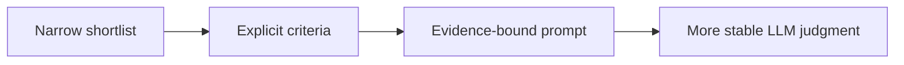

# Pattern 08: LLM-as-Judge Reliability

  

## Quick take
LLM-based scoring can be valuable, but only when it is grounded, tightly scoped, and placed late in the pipeline. Reliability usually drops when the model has to search too much, infer too much, or invent missing evidence.



## Why this matters
People often treat a good explanation as proof of a good judgment. It is not. A model can sound convincing while still drifting because the evidence window is broad, the scoring rubric is vague, or hard rules were never separated from soft reasoning.

The safest use of an LLM judge is comparative work on a small shortlist with explicit criteria and evidence-based outputs. Deterministic logic should still own binary rules, thresholds, and hard constraints.

## A better judge prompt shape
The reliable version is usually:

```text
- provide only the shortlist
- provide explicit criteria
- require evidence-backed scoring
- separate score from explanation
- forbid guessing missing facts
```

```python
prompt = f"""
Score each candidate against these criteria: {criteria}
Use only the provided evidence.
Return:
- score
- evidence snippets
- short explanation

Candidates:
{shortlist}
"""
```

This is much safer than asking the model to "pick the best one" from a broad, messy pool with no scoring rubric.

## Practical rule
If the judge prompt does not contain explicit criteria and visible evidence, the system is usually asking the model to improvise too much. Reliability improves when the shortlist is small, the rubric is clear, and the output shape is constrained.

| More reliable | Less reliable |
|---|---|
| small shortlist | broad messy pool |
| explicit rubric | vague “pick the best” prompt |
| evidence-backed output | unsupported explanation |
| constrained JSON or score shape | loose free-form judgment |

---
[](../README.md)
[](07-cost-latency-budgeting.md)
[](../decision-guides/when-to-use-llm-as-judge.md)
[](09-embedding-model-selection.md)
