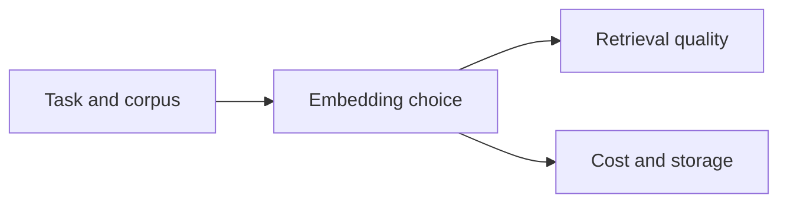

# Pattern 09: Embedding Model Selection

  

## Quick take
Choosing an embedding model is a system tradeoff, not just a leaderboard decision. Domain fit, latency, cost, vector size, and how the model behaves on your real retrieval failures all matter more than a single benchmark score.



## Why this matters
A stronger model on paper does not automatically rescue a weak retrieval design. Sometimes the real fix is hybrid retrieval, better chunking, or better hard filters instead of swapping models.

When model selection does matter, the core questions are simple: does it fit the language and domain, does the latency work for your product, does the vector footprint fit your storage budget, and does it improve the failure cases you actually care about?

## A simple evaluation loop
The first useful evaluation is usually not a benchmark leaderboard. It is a small set of real queries and known-good target documents.

```python
def evaluate_embedding_model(queries, docs, embed_fn):
    results = []
    for query in queries:
        ranked = semantic_retrieve(query["text"], docs, embed_fn, top_k=10)
        hit = query["expected_doc_id"] in [doc["id"] for doc in ranked]
        results.append(hit)
    return sum(results) / len(results)
```

Compare models on:
- whether the right item appears in top-k
- whether abbreviations still fail
- whether latency is acceptable
- whether storage cost stays reasonable

If two models are close, pick the cheaper or simpler one and improve the pipeline logic around it.

| If the issue is | Fix model? |
|---|---|
| wrong paraphrase behavior | maybe yes |
| abbreviations like `RN` or `SOC 2` | usually not enough by itself |
| weak chunking or missing filters | no, fix pipeline first |
| storage or latency pressure | maybe pick a lighter model |

## Practical rule
Change the embedding model when evaluation shows a real retrieval gain on your task. Do not change it just because a benchmark looks better if your actual bottleneck is abbreviations, chunking, missing filters, or weak hybrid design.

---
[](../README.md)
[](08-llm-as-judge-reliability.md)
[](../decision-guides/embedding-vs-keyword-vs-hybrid.md)
