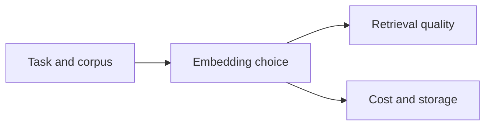

# Pattern 09: Embedding Model Selection

 

## Quick take
Choosing an embedding model is a system tradeoff, not just a leaderboard decision. Domain fit, latency, cost, vector size, and how the model behaves on your real retrieval failures all matter more than a single benchmark score.

## Why this matters
A stronger model on paper does not automatically rescue a weak retrieval design. Sometimes the real fix is hybrid retrieval, better chunking, or better hard filters instead of swapping models.

When model selection does matter, the core questions are simple: does it fit the language and domain, does the latency work for your product, does the vector footprint fit your storage budget, and does it improve the failure cases you actually care about?

## Where this goes next
This page will grow into domain-fit evaluation, model swap criteria, vector size tradeoffs, and guidance on when pipeline logic matters more than model choice.

---

