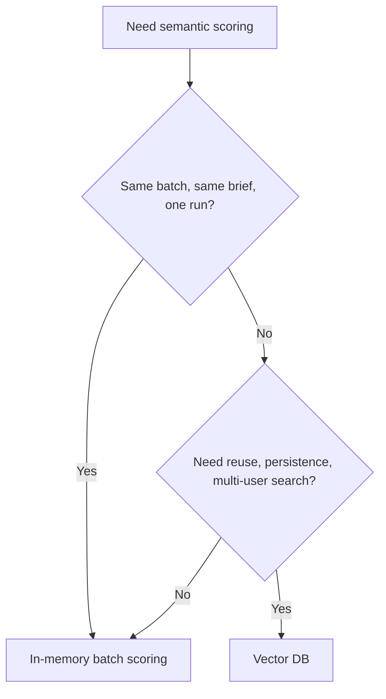

# Pattern 11: In-Memory Batch Scoring vs Vector DB

  

## Quick take
Do not reach for a vector DB just because embeddings exist. First ask whether the work is a one-run batch job or a persistent retrieval system.



## Why this decision matters
This is one of the most common architecture mistakes in LLM systems. People build a vector store first, then discover the real task was just "score this batch now."

If the data arrives, gets scored against one active brief, and then can be discarded, in-memory scoring is often the cleaner design:
- no indexing layer to maintain
- no extra write path
- easier cleanup
- easier debugging

If the same content must be searched again tomorrow, shared across users, filtered repeatedly, or updated over time, a vector DB becomes much more reasonable.

## Decision table

| Situation | Better fit | Why |
|---|---|---|
| One batch of proposals against one active brief | `In-memory` | Simple, cheap, no persistence tax |
| Frequent reuse of the same corpus | `Vector DB` | You pay indexing once and query many times |
| Multi-user retrieval service | `Vector DB` | Shared storage and filtering matter |
| Temporary scoring job with strong pre-filters | `In-memory` | Less moving infrastructure |
| Local experimentation | `Chroma` | Lightweight local option |
| Hosted production retrieval | `Pinecone` | Persistent managed service |

## In-memory flow
This is the strong fit for bulk proposal scoring:

```text
load current batch
-> pre-filter hard mismatches
-> embed brief once
-> embed the current proposal batch
-> score and keep the best rows
-> rerank or judge the shortlist
-> clean up memory
```

That flow matches one-run scoring very well because the embeddings are useful immediately and disposable afterward.

## Vector DB flow
This is better when the retrieval layer has to live beyond one run:

```text
parse and chunk documents
-> generate embeddings
-> upsert vectors and metadata
-> query by vector or text
-> rerank the returned set
-> reuse the store across many requests
```

This is where services like Pinecone start making sense, and where a local store like Chroma is helpful for development or small local workflows.

## Code shape
The decision becomes easier when you write it this way:

```python
def choose_storage_mode(job_shape):
    if job_shape["one_run_batch"] and not job_shape["needs_reuse"]:
        return "in_memory"

    if job_shape["multi_user"] or job_shape["needs_reuse"]:
        return "vector_db"

    return "in_memory"
```

This is not about perfect theory. It is about protecting the system from unnecessary infrastructure.

## Practical recommendation
Start with in-memory scoring when:
- the brief changes per run
- the batch is bounded
- the results do not need long-term search

Move to a vector DB when:
- the corpus persists
- retrieval becomes a shared service
- metadata filtering and reuse matter more than one-run simplicity

---
[](../README.md)
[](10-batch-calls-and-throughput.md)
[](../examples/proposal-to-brief-with-vector-store/README.md)
[](12-cache-cleanup-and-memory-control.md)
