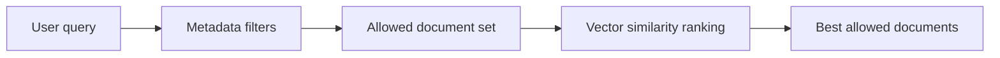

# Pattern 13: Metadata Filters Before Vector Search

  

## Quick take
Pattern 01 teaches the full layered pipeline. This pattern zooms into one step for vector retrieval systems: narrow the allowed pool with metadata, then rank inside that pool with vector similarity.



## Problem
A common mistake is to store only document text in the vector DB and then run broad semantic search across the full index.

In real systems, you often already know useful structured facts at ingestion time, such as:
- `tenant_id`
- `region`
- `language`
- `document_type`
- `status`

Those fields should usually be stored as metadata alongside the vectors. Then, when a query already has known constraints, the system can use those metadata filters to narrow the candidate pool first.

That is the real problem this pattern fixes: without metadata-aware retrieval, semantic search ends up searching too much of the knowledge base and trying to guess rules that the system already knew.

## Core idea
Use metadata filters for hard boundaries. Use vector similarity for meaning-based ranking.

Conceptually, the safe mental order is:

```text
apply metadata filters
-> keep only the allowed documents
-> rank the allowed set by vector similarity
-> answer from the best allowed matches
```

In a real vector database, this is often one vector query with a metadata filter attached. In this teaching pattern, the steps are shown separately so the system design stays obvious.

## Tiny example
Query:

```text
What is the refund policy for delayed delivery?
```

Metadata filter:

```python
metadata_filter = {
    "region": "US",
    "document_type": "policy",
    "status": "published",
}
```

Only published US policy documents should compete. Draft documents should not compete. Blog posts should not compete. Wrong-region policy documents should not compete, even if their wording looks very similar.

This is the bridge from Pattern 01's general `pre-filter first` idea to a more production-shaped vector retrieval system.

## Bad Pattern: Search Everything, Filter Later
Filtering after retrieval sounds harmless, but it weakens the system:
- wrong documents can dominate top-k
- valid documents may never appear in the first place
- search gets slower
- access-controlled retrieval becomes riskier

If the allowed slice matters, search-everything-first is the wrong default.

## Good Pattern: Filter First, Rank Second
The stronger default is simple:

```text
hard boundaries with metadata
-> semantic ranking inside that boundary
-> rerank or LLM judge only if needed
```

This keeps structured rules deterministic and leaves semantic work to the stage that is good at it.

## Hard filter vs vector ranking

| Rule | Use metadata filter? | Why |
|---|---|---|
| `region must be US` | Yes | Hard boundary |
| `document must be policy` | Yes | Hard boundary |
| `status must be published` | Yes | Hard boundary |
| `text should discuss refunds` | No | Use vector similarity |
| `text should mention delays` | No | Use vector similarity |

## Simple code shape
Keep the code shape boring and readable:

```python
metadata_filter = {
    "region": "US",
    "document_type": "policy",
    "status": "published",
}

allowed_docs = filter_documents(documents, metadata_filter)
ranked_docs = vector_rank(query, allowed_docs)
```

That is the key design move. In a real vector DB, this often becomes one vector query with metadata filters attached. The Chroma example in this repo shows that exact query shape directly with `query_texts=[...]` plus `where={...}`.

## Real vector DB shape
If you are using a real vector store, the same pattern often looks like this.

Pinecone:

```python
results = index.query(
    vector=query_vector,
    top_k=5,
    filter={
        "region": {"$eq": "US"},
        "document_type": {"$eq": "policy"},
        "status": {"$eq": "published"},
    },
    include_metadata=True,
)
```

Chroma:

```python
results = collection.query(
    query_texts=[query],
    n_results=5,
    where={
        "region": "US",
        "document_type": "policy",
        "status": "published",
    },
)
```

The local Chroma example in this repo shows this as runnable code. These query shapes show how the same filter-first idea appears in both local and hosted production code.

## Common mistakes
- using vector search across everything
- adding too many metadata fields too early
- storing inconsistent values like `US`, `USA`, and `United States`
- filtering after retrieval instead of before
- having no fallback when filters return zero documents

## Practical default
Start with 2-3 reliable filters. Normalize metadata at ingestion. Filter first. Vector-rank second. Add rerank or LLM judgment only when the filtered retrieval pool still needs help.

---
[](../README.md)
[](12-cache-cleanup-and-memory-control.md)
[](01-pre-filter-embed-llm-judge.md)
[](11-in-memory-batch-scoring-vs-vector-db.md)
[](../examples/metadata-filtered-vector-search/README.md)
