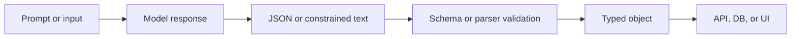

# Pattern 14: Structured Output Contracts

   

## Quick take
LLM output is not application data until it passes a contract.



## Problem
Many projects start with a prompt like "return JSON" and then treat the result as ready-to-use data.

That is the weak version.

Even when the response parses as JSON, it can still break the application:
- keys may drift
- enums may change shape
- booleans may come back as strings
- extra explanation text may wrap the JSON
- nested objects may be missing required fields

The problem is not just formatting. The problem is trust. JSON is only a format. A contract is what makes the format safe for software.

## Core idea
Use the model to generate in a constrained shape. Use application code to validate the result before anything downstream depends on it.

The safe mental order is:

```text
generate in a constrained format
-> parse
-> validate
-> use the typed result
```

This separates two different jobs:
- generation control
- application safety

## Tiny example
Support ticket routing is a clean fit for this pattern.

Use one schema through the whole flow:

```python
from typing import Literal

from pydantic import BaseModel, Field


class TicketDecision(BaseModel):
    category: Literal["billing", "technical", "account", "other"]
    priority: Literal["low", "medium", "high"]
    summary: str = Field(min_length=1, max_length=160)
    requires_human_review: bool
```

Weak version:

```text
"Read this ticket and tell me where it should go."
```

Stronger version:

```text
"Classify this ticket into one of: billing, technical, account, other.
Return category, priority, summary, and requires_human_review."
```

Then validate the result before the router uses it.

That keeps the model responsible for judgment and keeps the application responsible for safety.

## The reliability ladder

| Level | Method | What it controls | Use when |
|---|---|---|---|
| `1` | Prompt-only JSON | prompt describes the shape | demos, quick tests |
| `2` | JSON mode + prompt schema | provider forces JSON, prompt describes fields | simple apps |
| `3` | Provider schema mode | provider receives the actual schema | recommended generation method |
| `4` | Pydantic validation boundary | app validates final output | always |

`Levels 1-3` are generation strategies. `Level 4` is the application safety boundary.

That distinction matters. `Pydantic` is not another sibling generation method. It is the boundary that decides whether the response is safe to use.

## Schema placement
There are two places a schema can appear:

1. In the prompt. The model is instructed to follow it.
2. In provider config. The endpoint receives the schema as part of the API call.

Prompt schema is guidance. Provider schema is stronger generation control. `Pydantic` is final application validation.

## Level 1: Prompt-only JSON
Prompt-only JSON is still useful. It is often the first thing people try, and it can be enough for simple demos or endpoints that expose only plain text generation.

The weakness is that the model is still free to drift.

Minimal shape:

```python
prompt = """
Classify the support ticket.

Return JSON only with these keys:
- category
- priority
- summary
- requires_human_review
"""

text = call_model(prompt)
decision = TicketDecision.model_validate_json(text)
payload = decision.model_dump(mode="json")
```

This is still fragile. The model may add prose, rename a key, or return a value outside your allowed set. The validation step stays important because the prompt alone does not force the shape.

## Level 2: JSON mode + prompt schema
If the endpoint supports JSON mode, use it. This gives stronger format control than prompt text alone because the endpoint forces JSON output.

JSON mode controls the output format. It does not prove the response matches your application schema.

The exact method call differs by provider. The design idea stays the same:

```text
define the expected fields in the prompt
-> ask the endpoint for JSON output
-> parse the response
-> validate it in application code
```

Minimal shape:

```python
prompt = """
Classify the support ticket.

Return valid JSON with:
- category: one of billing, technical, account, other
- priority: one of low, medium, high
- summary: one short sentence
- requires_human_review: boolean
"""

response_text = call_model_in_json_mode(
    prompt=prompt,
)

decision = TicketDecision.model_validate_json(response_text)
```

JSON mode is better than prompt-only JSON, but the provider still does not know your actual application schema unless you pass it separately.

## Level 3: Provider schema mode
Provider schema mode is stronger because the endpoint receives the actual schema as part of the API call.

Keep the same schema and pass it forward:

```python
schema = TicketDecision.model_json_schema()
```

OpenAI-style shape:

```python
response = client.responses.parse(
    model="gpt-4.1-mini",
    input=prompt,
    text_format=TicketDecision,
)

decision = response.output_parsed
```

Gemini-style shape:

```python
response = client.models.generate_content(
    model="gemini-3.5-flash",
    contents=prompt,
    config={
        "response_format": {
            "text": {
                "mime_type": "application/json",
                "schema": TicketDecision.model_json_schema(),
            }
        }
    },
)

decision = TicketDecision.model_validate_json(response.text)
```

Do not over-focus on the SDK differences. The useful part is that the provider now receives the intended structure instead of inferring it only from prompt wording.

## Level 4: Pydantic validation boundary
This is the final safety layer.

```text
schema-aware generation
-> parse
-> validate
-> typed object
```

Use a small schema to define the contract your application expects. Then validate every model response against it before writing to a database, calling an API, or driving UI logic.

Keep the flow boring and explicit:

```python
schema = TicketDecision.model_json_schema()

response_text = call_model_with_schema(
    prompt=prompt,
    schema=schema,
)

decision = TicketDecision.model_validate_json(response_text)
```

That gives you one clean boundary:
- invalid enum values fail
- missing required fields fail
- wrong types fail
- downstream code receives a typed object instead of raw model text

## Provider support is part of the contract
Provider support is endpoint-specific, not only model-specific.

A model may support structured output on one endpoint and not another. Always check the exact provider, SDK, model, and serving stack.

| If the endpoint supports | Recommended shape |
|---|---|
| schema mode | schema mode + application validation |
| JSON mode only | JSON mode + application validation |
| plain text only | constrained text + deterministic parsing + validation |
| support is unclear | test the exact endpoint first |

## When schema mode is unavailable
Some endpoints expose only plain text generation. This is common in smaller deployments, private hosting setups, local model stacks, and chat-only wrappers.

That does not mean you cannot build a structured system.

The safer fallback is:

```text
ask for tiny constrained output
-> parse deterministically
-> build the structured object in application code
-> validate before use
```

For weaker endpoints, do not ask for a large nested JSON object if a tiny classification is enough.

Ask for a small fixed shape instead:

```text
route=billing
priority=high
```

Then parse it in a boring way:

```python
def parse_key_value_lines(text: str) -> dict[str, str]:
    parsed: dict[str, str] = {}

    for line in text.strip().splitlines():
        if "=" not in line:
            continue

        key, value = line.split("=", 1)
        parsed[key.strip()] = value.strip()

    return parsed


parsed = parse_key_value_lines(response_text)

decision = TicketDecision.model_validate(
    {
        "category": parsed["route"],
        "priority": parsed["priority"],
        "summary": ticket_summary,
        "requires_human_review": parsed["priority"] == "high",
    }
)
```

This fallback is often more reliable than asking a weak endpoint for deeply nested JSON.

## Bad pattern: Trust the response directly
The weak production pattern looks like this:

```text
ask for JSON
-> parse if possible
-> send directly to DB, API, or router
```

That creates avoidable failures:
- silent enum drift
- missing keys
- type mismatches
- fragile downstream branching

## Good pattern: Contract before use
The stronger pattern looks like this:

```text
constrain generation
-> validate against a schema or parser contract
-> retry, reject, or repair if invalid
-> use only the validated result
```

This keeps the LLM useful without letting it become an untrusted data source that controls the rest of the system.

## Common mistakes
- treating valid JSON as if it were already safe application data
- assuming support from the model name alone instead of the real endpoint
- skipping application-side validation because the provider already has JSON mode
- asking smaller or weaker endpoints for large nested schemas too early
- having no fallback when the endpoint supports only plain text
- pushing the raw model response directly into routing, storage, or UI logic

## From typed object to payload
After validation, the model output becomes normal software data.

```python
def build_ticket_payload(decision: TicketDecision) -> dict:
    return decision.model_dump(mode="json")
```

## Practical default
If you want a healthy default, start here:

```text
define a small schema
-> use provider schema mode when available
-> validate with Pydantic
-> fall back to constrained text parsing when schema mode is unavailable
```

That is the real pattern: not "make the model speak JSON," but "build a contract between the model and the application."

---
[](../README.md)
[](13-metadata-filters-before-vector-search.md)
[](15-prompt-injection-fast-filter-blind-judge.md)
[](07-cost-latency-budgeting.md)
[](08-llm-as-judge-reliability.md)
[](../examples/structured-output-contracts/README.md)
